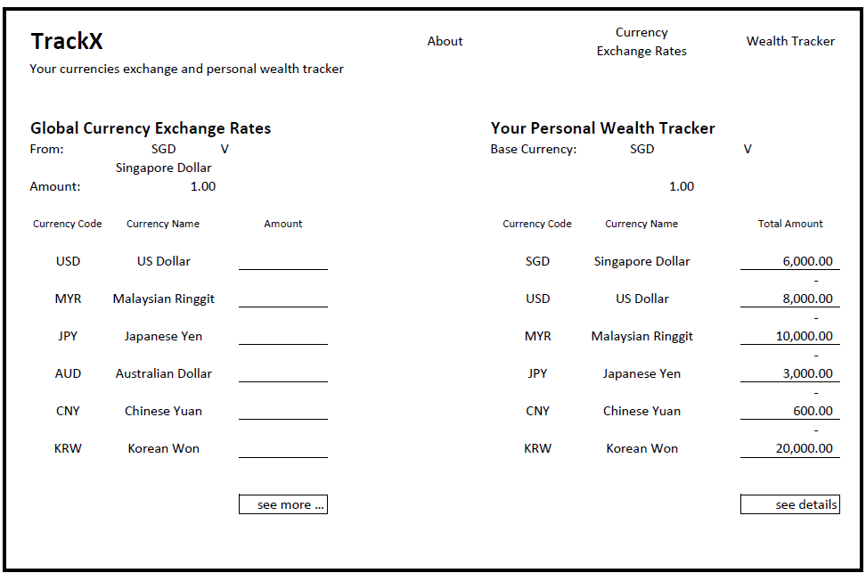
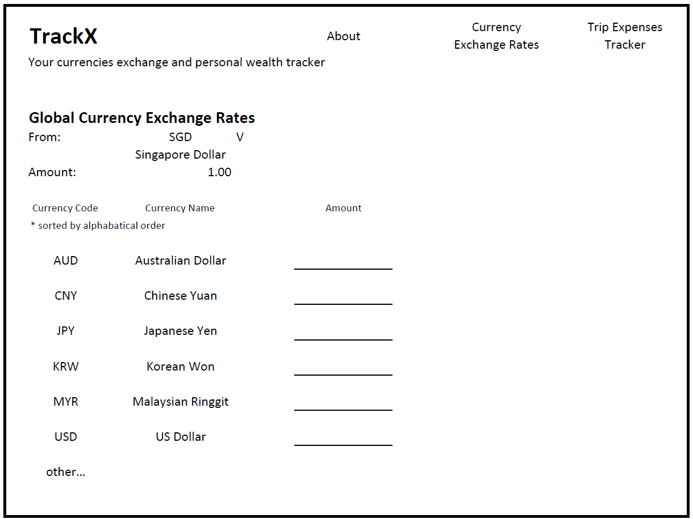
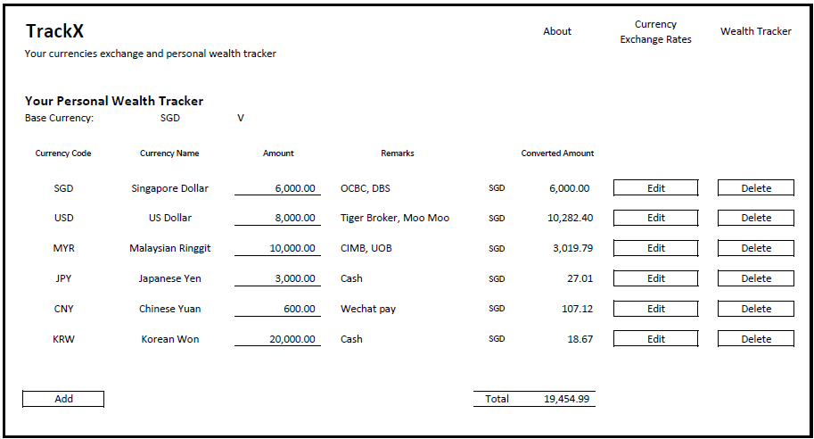

# TrackX - Your console.log(s)

## Project Brief

## Timeframe

1 week

## Technologies used

React 
Bruno  
libraries

## Description

This apps is called TrackX, means currency exchange and wealth tracker.

## Wireframe

by considering what to include in my apps and what are the features to be included, I have prepared the wireframe of my apps as follows:

Figure 1: Main page of TrackX 
 

Figure 2: Currency Exchange Rate page of TrackX 
 

Figure 3: Wealth Tracker page of TrackX 
 

### buy or sell

## User stories

1. As a user, I want to see the popular currency exchange rates on the main page.
2. As a user, I want to see more currency exchange rates for different countries.
3. As a user, I want to input the amount to check the converted rate.
4. As a user, I want to change the base currency. (current base rate would SGD)
5. As a user, I want to check the historical rates.
6. As a user, I want to know how much is the summary of my total wealth for each currencies on the main page.
7. As a user, I want to track and see the details of my total wealth in different currenies.
8. As a user, I want to know what is my total wealth after converted to the base currency I chose.

## References

1. https://www.reddit.com/r/learnreactjs/comments/sgim34/fetch_api_works_then_suddenly_stops_working_after/#lightbox

2. https://www.google.com/search?q=can+i+have+thousand+indicator+in+react&rlz=1C1CHBF_en-GBSG1158SG1158&oq=can+i+have+thousand+indicator+in+react&gs_lcrp=EgZjaHJvbWUyCwgAEEUYChg5GKABMgkIARAhGAoYoAEyCQgCECEYChigAdIBCTExMzc2ajBqN6gCCLACAfEFekINyyaWzAk&sourceid=chrome&ie=UTF-8

## Attributions

1. https://currencybeacon.com/
