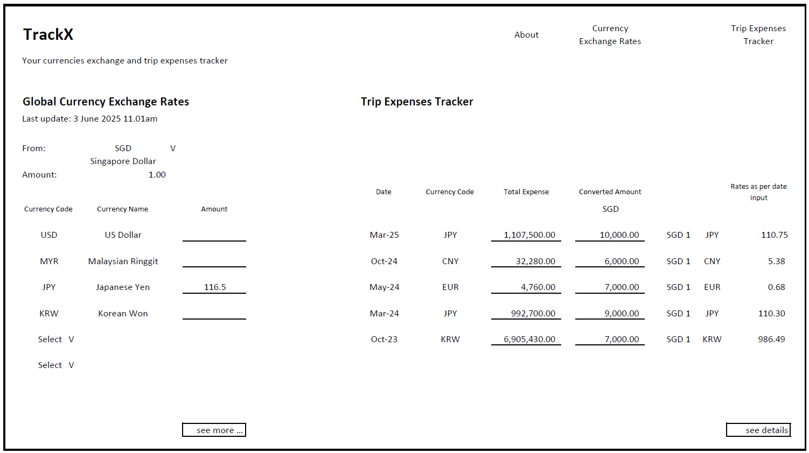

# TrackX - Your Currencies Exchange and Trip Expenses Tracker

## Project Brief

MVP - Minimum Viable Product

- Built with React using components, props, states and routes
- Call a public API using fetch
- At least 1 Create, 1 Update or 1 Delete functionallity using Airtable

## Timeframe

1 week

## Technologies used

- React 
- Bruno  
- Airtable  

## Description

TrackX is an app that allows users to track global currency exchange rates and record their travel expenses based on trip dates. This helps users understand the actual expenses incurred, converted to a base currency — by default, Singapore Dollar (SGD). Users can also change the base currency and the amount to be converted as needed. 
 

## Wireframe

Based on the planned features at the early stage, I have drafted a wireframe and outlined the following user interactions:

1. User will see the popular currency exchange rates on the main page.
2. User can check out more currency exchange rates for different countries.
3. User can input an amount to check the converted rate.
4. User can change the base currency.
5. User can view the historical rates.
6. User can record their total expenses of the trip based on the trip dates and currency rates.
7. User can add, edit and delete their previous trip's records.

Figure 1: Main page of TrackX 
 

Figure 2: Global Currency Exchange Rates page of TrackX 
 

Figure 3: Trip Expenses Tracker page of TrackX 
 

## Key Learning

There are some challenges encountered when developing an App using Rect with API fetching and data storing with Airtable.

1. API Integration and Data Transformation:

- One of the challenges is to define the API endpoint URLs correctly in order to get the JSON data, and to display and extract the fetched data correctly as the JSON converted JS object might not be in an ideal form, hence, extract the data with the correct object key is crucial.

2. State Management and Airtable CRUD Operations:

- Performing Create, Read, Update, and Delete (CRUD) operations with Airtable are quite complex as Airtable required precise formatting in receiving requests, hence, constructing the correct URL and request body is important dealing with Airtable. Small errors like syntax error or data type can prevent data from being updated.

3. Asynchronous Data Handling and Component Communication:

- Errors encountered during data handling and lifting from a components also quite challenging, for example, data is undefined and application crashes when components attempt to render data that has not yet been fetched. This is due to the codes execute before the data is retrieved. Hence, I found out that useEffect hook is very helpful in addressing these issues by allowing logic that depends on fetched data to execute only when the data is available.

## Future Enhancement

Due to time constraints and this being my first attempt using React and MUI libraries, some features have not yet been developed. If there would be a future development on this game, I would like to improve and implement the following:

1. Display country flags and country names alongside the currency code.
2. Enable users to view historical exchange rates in a more detailed view.
3. Allow users to edit previously recorded trip expenses.
4. Apply the built-in select function in data grid table , e.g. using the checkbox function in data grid to carry out action like delete and edit.
5. Allow users to change the base currency for the trip expense tracker according to their preference.

## References

1. https://www.reddit.com/r/learnreactjs/comments/sgim34/fetch_api_works_then_suddenly_stops_working_after/#lightbox

2. https://www.google.com/search?q=can+i+have+thousand+indicator+in+react&rlz=1C1CHBF_en-GBSG1158SG1158&oq=can+i+have+thousand+indicator+in+react&gs_lcrp=EgZjaHJvbWUyCwgAEEUYChg5GKABMgkIARAhGAoYoAEyCQgCECEYChigAdIBCTExMzc2ajBqN6gCCLACAfEFekINyyaWzAk&sourceid=chrome&ie=UTF-8

3. https://www.google.com/search?q=how+to+set+time+to+12hour+in+react&sca_esv=813765718ccf2407&rlz=1C1CHBF_en-GBSG1158SG1158&ei=Qv1HaP_4MMSJ4-EP5o3V0QU&ved=0ahUKEwj_odLBx-aNAxXExDgGHeZGNVoQ4dUDCBA&uact=5&oq=how+to+set+time+to+12hour+in+react&gs_lp=Egxnd3Mtd2l6LXNlcnAiImhvdyB0byBzZXQgdGltZSB0byAxMmhvdXIgaW4gcmVhY3QyBxAhGKABGAoyBxAhGKABGAoyBRAhGJ8FSKYXUJ4FWJEVcAF4AZABAJgBjwGgAfoGqgEDNS40uAEDyAEA-AEBmAIKoAKuB8ICChAAGLADGNYEGEfCAgYQABgWGB7CAgsQABiABBiGAxiKBcICCBAAGIAEGKIEwgIFEAAY7wWYAwDiAwUSATEgQIgGAZAGCJIHAzUuNaAHh02yBwM0LjW4B6gHwgcFMC4zLjfIByk&sclient=gws-wiz-serp

4. https://www.w3schools.com/react/react_useeffect.asp

## Attributions

1. API source: CurrencyBeacon - https://currencybeacon.com/
2. Component library: Material UI - https://bestofjs.org/projects/material-ui
